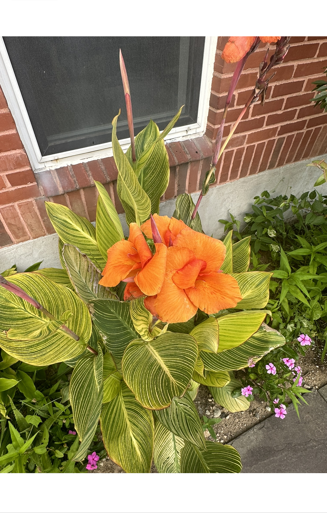

# pictures :)


<div id='slideshow'>

```{include} _static/buttons.html
```


```{card}
:class-card: slide


+++
this is a flower i found at the college of pharmacy garden
```

```{card}
:class-card: slide


+++

a dragonfly caption?
```

</div>